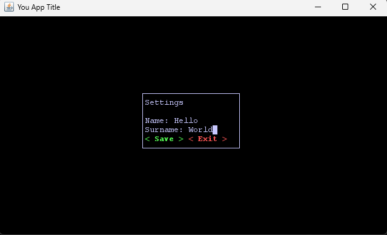
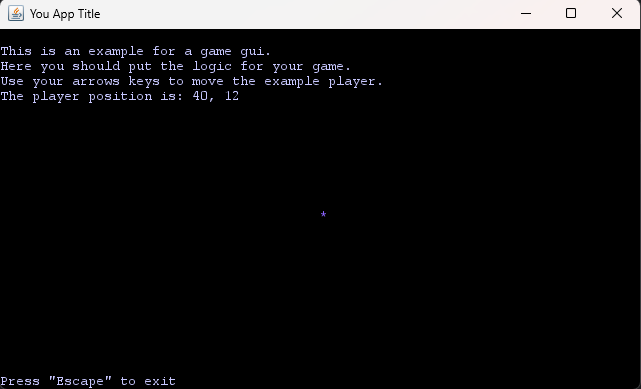

# Lanterna Template
## Overview
This template provides a simple and easy way to use the Lanterna library in your project. It includes the following features:
 - Terminal GUI Class: Easily create terminal-based graphical user interfaces, including support for resizing.
 - Main Menu: A basic main menu implementation.
 - Error Handling: Includes error handling mechanisms.
 - Utils and Constants: Utility classes for common functionality.
 - Basic Game Implementation: A simple game example.
 - Configuration API: A class that allows to read and load configurations from files
 - Music Manager: Allows soundtracks stored in to files to be played
## [Official documentation](https://github.com/mabe02/lanterna/blob/master/docs/contents.md)
For detailed information on using Lanterna, refer to the official documentation.
## Screenshots
 - Main Menu  

 - About Menu  

 - Settings Menu  

 - Game Example  
## The goal

The primary goal of this template is
to provide an organized class structure for using Lanterna in your projects.
 Feel free to change it as needed.

